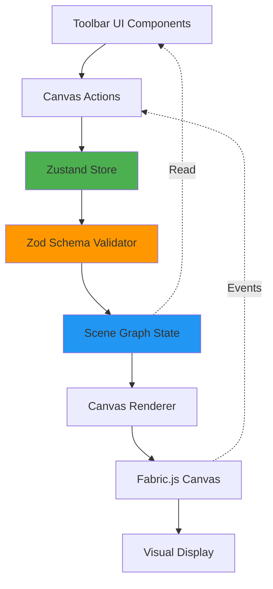
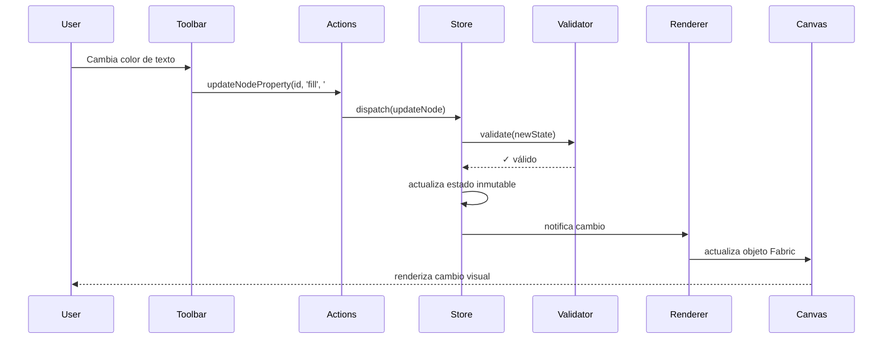

# Documento de Diseño: Canvas Editor Scene Graph

## Resumen General

El Canvas Editor Scene Graph es un motor de personalización de plantillas basado en un árbol jerárquico de nodos (Scene Graph) para Duke Discount Manager. El sistema permite la manipulación visual de elementos gráficos mediante la mutación de un JSON estructurado exportado desde Fabric.js.

El motor proporciona capacidades completas de edición incluyendo estilizado de texto, transformaciones geométricas, estética visual y layout inteligente, todo gestionado a través de un estado inmutable con validación estricta mediante TypeScript y Zod.

La arquitectura se basa en un patrón unidireccional de flujo de datos: UI → Actions → State → Canvas Renderer, garantizando consistencia y predictibilidad en todas las operaciones de edición.

## Arquitectura del Sistema




## Diagrama de Secuencia: Flujo de Actualización de Propiedades



## Componentes e Interfaces

### Componente 1: Scene Graph State Manager

**Propósito**: Gestionar el estado completo del Scene Graph como un árbol jerárquico de nodos validados.

**Interface**:
```typescript
interface SceneGraphStore {
  // Estado
  root: GroupNode | null
  selectedNodeIds: string[]
  history: HistoryState
  
  // Acciones de Nodos
  updateNodeProperty: (nodeId: string, property: string, value: unknown) => void
  updateMultipleProperties: (nodeId: string, updates: Partial<SceneNode>) => void
  deleteNode: (nodeId: string) => void
  duplicateNode: (nodeId: string) => string
  
  // Acciones de Selección
  selectNode: (nodeId: string) => void
  selectMultipleNodes: (nodeIds: string[]) => void
  clearSelection: () => void
  
  // Acciones de Z-Index
  bringToFront: (nodeId: string) => void
  sendToBack: (nodeId: string) => void
  bringForward: (nodeId: string) => void
  sendBackward: (nodeId: string) => void
  
  // Acciones de Layout
  centerNode: (nodeId: string) => void
  distributeHorizontally: (nodeIds: string[]) => void
  distributeVertically: (nodeIds: string[]) => void
  groupNodes: (nodeIds: string[]) => string
  ungroupNodes: (groupId: string) => void
  
  // Historial
  undo: () => void
  redo: () => void
  
  // Utilidades
  findNodeById: (nodeId: string) => SceneNode | null
  getNodePath: (nodeId: string) => string[]
  exportToJSON: () => FabricJSON
}
```

**Responsabilidades**:
- Mantener el estado del Scene Graph como estructura inmutable
- Validar todas las mutaciones mediante Zod schemas
- Proporcionar acciones tipadas para manipular nodos
- Gestionar historial de deshacer/rehacer
- Notificar cambios a suscriptores (Canvas Renderer)


### Componente 2: Canvas Renderer

**Propósito**: Sincronizar el estado del Scene Graph con la representación visual de Fabric.js.

**Interface**:
```typescript
interface CanvasRenderer {
  initialize: (canvasElement: HTMLCanvasElement, initialState: GroupNode) => void
  syncNode: (node: SceneNode) => void
  syncTree: (root: GroupNode) => void
  dispose: () => void
  
  // Eventos
  onNodeSelected: (callback: (nodeId: string) => void) => void
  onNodeModified: (callback: (nodeId: string, changes: Partial<SceneNode>) => void) => void
}
```

**Responsabilidades**:
- Renderizar el Scene Graph usando Fabric.js
- Sincronizar cambios de estado con objetos Fabric
- Capturar eventos de usuario (selección, transformación)
- Propagar eventos al Store para actualizar estado

### Componente 3: Validation Layer

**Propósito**: Garantizar la integridad de datos mediante validación estricta con Zod.

**Interface**:
```typescript
interface ValidationLayer {
  validateNode: (node: unknown) => SceneNode
  validateUpdate: (nodeId: string, property: string, value: unknown) => boolean
  validateTree: (root: unknown) => GroupNode
}
```

**Responsabilidades**:
- Validar estructura de nodos contra schemas Zod
- Prevenir mutaciones inválidas
- Proporcionar mensajes de error descriptivos
- Garantizar type safety en runtime

## Modelos de Datos

### Modelo Base: SceneNode

```typescript
// Tipos de nodos soportados
type NodeType = 'group' | 'textbox' | 'rect' | 'circle' | 'path' | 'polygon' | 'image'

// Propiedades base compartidas por todos los nodos
interface BaseNode {
  id: string
  name: string
  type: NodeType
  
  // Geometría
  left: number
  top: number
  width: number
  height: number
  angle: number
  scaleX: number
  scaleY: number
  
  // Transformaciones
  originX: 'left' | 'center' | 'right'
  originY: 'top' | 'center' | 'bottom'
  flipX: boolean
  flipY: boolean
  skewX: number
  skewY: number
  
  // Estilo visual
  opacity: number
  visible: boolean
  fill: string | GradientFill
  stroke: string | null
  strokeWidth: number
  shadow: Shadow | null
  
  // Metadata
  selectable: boolean
  evented: boolean
  locked: boolean
}
```


### Modelo: TextNode

```typescript
interface TextNode extends BaseNode {
  type: 'textbox'
  text: string
  
  // Estilo de fuente
  fontFamily: string
  fontSize: number
  fontWeight: 'normal' | 'bold' | number
  fontStyle: 'normal' | 'italic'
  
  // Decoración
  underline: boolean
  linethrough: boolean
  overline: boolean
  
  // Transformación de texto
  textTransform: 'none' | 'uppercase' | 'lowercase' | 'capitalize'
  
  // Espaciado
  charSpacing: number
  lineHeight: number
  
  // Alineación
  textAlign: 'left' | 'center' | 'right' | 'justify'
  
  // Comportamiento
  editable: boolean
  splitByGrapheme: boolean
}
```

**Reglas de Validación**:
- `text` no puede estar vacío
- `fontSize` debe ser > 0 y <= 500
- `charSpacing` rango: -200 a 800
- `lineHeight` rango: 0.5 a 3.0
- `fontWeight` si es número: 100-900 en incrementos de 100

### Modelo: ShapeNode (Rect, Circle, Polygon)

```typescript
interface RectNode extends BaseNode {
  type: 'rect'
  rx: number  // border radius X
  ry: number  // border radius Y
}

interface CircleNode extends BaseNode {
  type: 'circle'
  radius: number
}

interface PolygonNode extends BaseNode {
  type: 'polygon'
  points: Array<{ x: number; y: number }>
}
```

**Reglas de Validación**:
- `rx`, `ry` >= 0
- `radius` > 0
- `points` debe tener al menos 3 puntos para polígonos

### Modelo: PathNode

```typescript
interface PathNode extends BaseNode {
  type: 'path'
  path: PathCommand[]
}

type PathCommand = 
  | ['M', number, number]  // MoveTo
  | ['L', number, number]  // LineTo
  | ['C', number, number, number, number, number, number]  // CubicBezier
  | ['Q', number, number, number, number]  // QuadraticBezier
  | ['Z']  // ClosePath
```

**Reglas de Validación**:
- `path` no puede estar vacío
- Primer comando debe ser 'M' (MoveTo)


### Modelo: GroupNode

```typescript
interface GroupNode extends BaseNode {
  type: 'group'
  objects: SceneNode[]
  
  // Layout manager
  layoutManager?: {
    type: 'layoutManager'
    strategy: 'fit-content' | 'fixed' | 'clip'
  }
}
```

**Reglas de Validación**:
- `objects` puede estar vacío (grupo sin hijos)
- Cada hijo debe tener un `id` único dentro del árbol
- No se permiten referencias circulares

### Modelo: Tipos Auxiliares

```typescript
// Gradiente
interface GradientFill {
  type: 'linear' | 'radial'
  coords: {
    x1: number
    y1: number
    x2: number
    y2: number
    r1?: number  // solo para radial
    r2?: number  // solo para radial
  }
  colorStops: Array<{
    offset: number  // 0-1
    color: string
  }>
}

// Sombra
interface Shadow {
  color: string
  blur: number
  offsetX: number
  offsetY: number
}

// Union type de todos los nodos
type SceneNode = TextNode | RectNode | CircleNode | PolygonNode | PathNode | GroupNode

// Estado de historial
interface HistoryState {
  past: GroupNode[]
  present: GroupNode
  future: GroupNode[]
  maxSize: number
}

// JSON exportado de Fabric.js
interface FabricJSON {
  version: string
  objects: unknown[]
  [key: string]: unknown
}
```

## Pseudocódigo Algorítmico

### Algoritmo Principal: Actualización de Propiedad de Nodo

```typescript
function updateNodeProperty(nodeId: string, property: string, value: unknown): void
```

**Precondiciones:**
- `nodeId` existe en el Scene Graph
- `property` es una propiedad válida del tipo de nodo
- `value` cumple con las reglas de validación para esa propiedad

**Postcondiciones:**
- El nodo con `nodeId` tiene la propiedad actualizada
- El estado es inmutable (se crea nueva referencia)
- El historial registra el cambio para undo/redo
- Los suscriptores son notificados del cambio

**Invariantes de Bucle:** N/A (operación atómica)


```typescript
// Algoritmo paso a paso
ALGORITHM updateNodeProperty(nodeId, property, value)
INPUT: nodeId (string), property (string), value (unknown)
OUTPUT: void (actualiza estado)

BEGIN
  // Paso 1: Validar entrada
  ASSERT nodeId !== null AND nodeId !== ""
  ASSERT property !== null AND property !== ""
  
  node ← findNodeById(nodeId)
  ASSERT node !== null
  
  // Paso 2: Validar tipo y valor
  schema ← getSchemaForNodeType(node.type)
  isValid ← schema.shape[property].safeParse(value)
  
  IF NOT isValid THEN
    THROW ValidationError(isValid.error)
  END IF
  
  // Paso 3: Crear nuevo estado inmutable
  newRoot ← cloneDeep(state.root)
  targetNode ← findNodeInTree(newRoot, nodeId)
  targetNode[property] ← value
  
  // Paso 4: Actualizar historial
  newHistory ← {
    past: [...state.history.past, state.root],
    present: newRoot,
    future: []
  }
  
  // Paso 5: Aplicar cambio
  setState({
    root: newRoot,
    history: newHistory
  })
  
  // Paso 6: Notificar renderer
  notifySubscribers('node:updated', { nodeId, property, value })
  
  ASSERT findNodeById(nodeId)[property] === value
END
```

**Precondiciones:**
- El store está inicializado con un root válido
- nodeId corresponde a un nodo existente en el árbol
- property es una clave válida en el tipo de nodo
- value pasa la validación del schema Zod

**Postcondiciones:**
- El nodo objetivo tiene la propiedad actualizada con el nuevo valor
- El estado anterior se preserva en history.past
- history.future se limpia (nueva rama de historial)
- El Canvas Renderer recibe notificación para re-renderizar

**Invariantes de Bucle:** N/A

### Algoritmo: Reordenamiento Z-Index (Traer al Frente)

```typescript
function bringToFront(nodeId: string): void
```

**Precondiciones:**
- `nodeId` existe y tiene un nodo padre (no es root)
- El nodo padre es de tipo 'group'

**Postcondiciones:**
- El nodo se mueve al final del array `objects` de su padre
- El orden visual refleja el cambio (nodo encima de todos sus hermanos)
- El historial registra el cambio

**Invariantes de Bucle:**
- Durante la búsqueda del nodo padre, todos los nodos visitados mantienen su estructura válida


```typescript
ALGORITHM bringToFront(nodeId)
INPUT: nodeId (string)
OUTPUT: void (actualiza orden z-index)

BEGIN
  // Paso 1: Encontrar nodo y su padre
  node ← findNodeById(nodeId)
  ASSERT node !== null
  
  parentPath ← getNodePath(nodeId)
  ASSERT parentPath.length > 1  // no es root
  
  parentId ← parentPath[parentPath.length - 2]
  parent ← findNodeById(parentId)
  ASSERT parent.type === 'group'
  
  // Paso 2: Encontrar índice actual
  currentIndex ← parent.objects.findIndex(n => n.id === nodeId)
  ASSERT currentIndex !== -1
  
  // Paso 3: Si ya está al frente, no hacer nada
  IF currentIndex === parent.objects.length - 1 THEN
    RETURN
  END IF
  
  // Paso 4: Crear nuevo estado con reordenamiento
  newRoot ← cloneDeep(state.root)
  newParent ← findNodeInTree(newRoot, parentId)
  
  // Remover del índice actual
  removedNode ← newParent.objects.splice(currentIndex, 1)[0]
  
  // Agregar al final
  newParent.objects.push(removedNode)
  
  // Paso 5: Actualizar estado e historial
  updateStateWithHistory(newRoot)
  
  // Paso 6: Notificar renderer
  notifySubscribers('node:reordered', { nodeId, newIndex: newParent.objects.length - 1 })
  
  ASSERT findNodeById(parentId).objects[objects.length - 1].id === nodeId
END
```

**Precondiciones:**
- nodeId existe en el Scene Graph
- El nodo tiene un padre de tipo 'group'
- El nodo no es el root

**Postcondiciones:**
- El nodo está en la última posición del array objects de su padre
- Todos los demás nodos hermanos mantienen su orden relativo
- El historial contiene el estado anterior

**Invariantes de Bucle:** N/A

### Algoritmo: Centrado Automático

```typescript
function centerNode(nodeId: string): void
```

**Precondiciones:**
- `nodeId` existe en el Scene Graph
- El nodo tiene un padre con dimensiones definidas

**Postcondiciones:**
- `node.left` y `node.top` están ajustados para centrar el nodo respecto a su padre
- Las dimensiones del nodo no cambian
- El historial registra el cambio

**Invariantes de Bucle:** N/A


```typescript
ALGORITHM centerNode(nodeId)
INPUT: nodeId (string)
OUTPUT: void (actualiza posición)

BEGIN
  // Paso 1: Obtener nodo y padre
  node ← findNodeById(nodeId)
  ASSERT node !== null
  
  parentPath ← getNodePath(nodeId)
  parent ← parentPath.length > 1 
    ? findNodeById(parentPath[parentPath.length - 2])
    : state.root
  
  ASSERT parent !== null
  
  // Paso 2: Calcular dimensiones efectivas del nodo
  effectiveWidth ← node.width * node.scaleX
  effectiveHeight ← node.height * node.scaleY
  
  // Paso 3: Calcular posición centrada
  centerX ← (parent.width / 2) - (effectiveWidth / 2)
  centerY ← (parent.height / 2) - (effectiveHeight / 2)
  
  // Paso 4: Ajustar según originX/originY
  IF node.originX === 'center' THEN
    centerX ← centerX + (effectiveWidth / 2)
  ELSE IF node.originX === 'right' THEN
    centerX ← centerX + effectiveWidth
  END IF
  
  IF node.originY === 'center' THEN
    centerY ← centerY + (effectiveHeight / 2)
  ELSE IF node.originY === 'bottom' THEN
    centerY ← centerY + effectiveHeight
  END IF
  
  // Paso 5: Aplicar cambios
  updateMultipleProperties(nodeId, {
    left: centerX,
    top: centerY
  })
  
  ASSERT node está visualmente centrado respecto a parent
END
```

**Precondiciones:**
- nodeId existe en el Scene Graph
- El nodo padre tiene width y height > 0
- node.scaleX y node.scaleY son valores válidos (> 0)

**Postcondiciones:**
- El centro visual del nodo coincide con el centro del padre
- Las propiedades left y top están actualizadas
- El nodo mantiene sus dimensiones y escala originales

**Invariantes de Bucle:** N/A

## Funciones Clave con Especificaciones Formales

### Función 1: findNodeById()

```typescript
function findNodeById(nodeId: string): SceneNode | null
```

**Precondiciones:**
- `nodeId` es una cadena no vacía
- El store tiene un root inicializado

**Postcondiciones:**
- Retorna el nodo con el id especificado, o null si no existe
- No modifica el estado del Scene Graph
- La búsqueda es exhaustiva (recorre todo el árbol si es necesario)

**Invariantes de Bucle:**
- Durante el recorrido DFS, todos los nodos visitados son válidos
- No se visita el mismo nodo dos veces


```typescript
ALGORITHM findNodeById(nodeId)
INPUT: nodeId (string)
OUTPUT: SceneNode | null

BEGIN
  IF state.root === null THEN
    RETURN null
  END IF
  
  // Búsqueda en profundidad (DFS)
  stack ← [state.root]
  
  WHILE stack.length > 0 DO
    ASSERT todos los nodos en stack son válidos
    
    current ← stack.pop()
    
    IF current.id === nodeId THEN
      RETURN current
    END IF
    
    IF current.type === 'group' THEN
      FOR each child IN current.objects DO
        stack.push(child)
      END FOR
    END IF
  END WHILE
  
  RETURN null
END
```

### Función 2: validateNode()

```typescript
function validateNode(node: unknown): SceneNode
```

**Precondiciones:**
- `node` es un objeto (no null, no undefined)

**Postcondiciones:**
- Si válido: retorna el nodo tipado correctamente
- Si inválido: lanza ZodError con detalles del error
- No modifica el objeto de entrada

**Invariantes de Bucle:**
- Durante la validación de arrays (objects, points), cada elemento se valida independientemente

```typescript
ALGORITHM validateNode(node)
INPUT: node (unknown)
OUTPUT: SceneNode (tipado)

BEGIN
  // Paso 1: Validar que es un objeto
  IF typeof node !== 'object' OR node === null THEN
    THROW ZodError("Expected object, received " + typeof node)
  END IF
  
  // Paso 2: Determinar tipo de nodo
  IF NOT node.type IN ['group', 'textbox', 'rect', 'circle', 'path', 'polygon'] THEN
    THROW ZodError("Invalid node type: " + node.type)
  END IF
  
  // Paso 3: Seleccionar schema apropiado
  schema ← getSchemaForType(node.type)
  
  // Paso 4: Validar contra schema
  result ← schema.safeParse(node)
  
  IF NOT result.success THEN
    THROW result.error
  END IF
  
  // Paso 5: Si es grupo, validar hijos recursivamente
  IF node.type === 'group' THEN
    FOR each child IN node.objects DO
      ASSERT validateNode(child) es válido
      validateNode(child)  // validación recursiva
    END FOR
  END IF
  
  RETURN result.data
END
```


### Función 3: groupNodes()

```typescript
function groupNodes(nodeIds: string[]): string
```

**Precondiciones:**
- `nodeIds` contiene al menos 2 elementos
- Todos los ids existen en el Scene Graph
- Todos los nodos tienen el mismo padre
- Ninguno de los nodos es el root

**Postcondiciones:**
- Se crea un nuevo GroupNode conteniendo los nodos especificados
- El nuevo grupo se inserta en la posición del primer nodo
- Los nodos originales se remueven de su padre
- Retorna el id del nuevo grupo
- El historial registra el cambio

**Invariantes de Bucle:**
- Durante la recolección de nodos, todos los nodos encontrados son válidos
- El orden relativo de los nodos se preserva en el nuevo grupo

```typescript
ALGORITHM groupNodes(nodeIds)
INPUT: nodeIds (string[])
OUTPUT: newGroupId (string)

BEGIN
  ASSERT nodeIds.length >= 2
  
  // Paso 1: Validar que todos los nodos existen y tienen mismo padre
  nodes ← []
  parentId ← null
  
  FOR each id IN nodeIds DO
    node ← findNodeById(id)
    ASSERT node !== null
    
    path ← getNodePath(id)
    currentParentId ← path[path.length - 2]
    
    IF parentId === null THEN
      parentId ← currentParentId
    ELSE
      ASSERT parentId === currentParentId  // mismo padre
    END IF
    
    nodes.push(node)
  END FOR
  
  parent ← findNodeById(parentId)
  ASSERT parent.type === 'group'
  
  // Paso 2: Calcular bounding box del grupo
  minX ← min(nodes.map(n => n.left))
  minY ← min(nodes.map(n => n.top))
  maxX ← max(nodes.map(n => n.left + n.width * n.scaleX))
  maxY ← max(nodes.map(n => n.top + n.height * n.scaleY))
  
  // Paso 3: Crear nuevo grupo
  newGroupId ← generateUniqueId()
  newGroup ← {
    id: newGroupId,
    type: 'group',
    name: 'Group',
    left: minX,
    top: minY,
    width: maxX - minX,
    height: maxY - minY,
    angle: 0,
    scaleX: 1,
    scaleY: 1,
    opacity: 1,
    visible: true,
    objects: []
  }
  
  // Paso 4: Ajustar posiciones relativas y agregar al grupo
  FOR each node IN nodes DO
    node.left ← node.left - minX
    node.top ← node.top - minY
    newGroup.objects.push(node)
  END FOR
  
  // Paso 5: Actualizar padre
  newRoot ← cloneDeep(state.root)
  newParent ← findNodeInTree(newRoot, parentId)
  
  // Encontrar índice del primer nodo
  firstIndex ← newParent.objects.findIndex(n => n.id === nodeIds[0])
  
  // Remover todos los nodos originales
  newParent.objects ← newParent.objects.filter(n => NOT nodeIds.includes(n.id))
  
  // Insertar grupo en la posición del primero
  newParent.objects.splice(firstIndex, 0, newGroup)
  
  // Paso 6: Actualizar estado
  updateStateWithHistory(newRoot)
  
  RETURN newGroupId
END
```


## Ejemplos de Uso

### Ejemplo 1: Actualizar color de texto

```typescript
// Obtener el store
const store = useCanvasStore()

// Cambiar el color de un nodo de texto
store.updateNodeProperty('text-node-123', 'fill', '#FF0000')

// Cambiar múltiples propiedades a la vez
store.updateMultipleProperties('text-node-123', {
  fill: '#FF0000',
  fontSize: 24,
  fontWeight: 'bold'
})
```

### Ejemplo 2: Aplicar transformaciones

```typescript
// Rotar un nodo 45 grados
store.updateNodeProperty('shape-456', 'angle', 45)

// Cambiar opacidad al 50%
store.updateNodeProperty('shape-456', 'opacity', 0.5)

// Escalar al doble de tamaño
store.updateMultipleProperties('shape-456', {
  scaleX: 2,
  scaleY: 2
})
```

### Ejemplo 3: Gestión de Z-Index

```typescript
// Traer al frente
store.bringToFront('node-789')

// Enviar al fondo
store.sendToBack('node-789')

// Mover una posición adelante
store.bringForward('node-789')
```

### Ejemplo 4: Layout inteligente

```typescript
// Centrar un nodo respecto a su padre
store.centerNode('logo-node')

// Agrupar múltiples nodos
const groupId = store.groupNodes(['node-1', 'node-2', 'node-3'])

// Distribuir horizontalmente
store.distributeHorizontally(['node-1', 'node-2', 'node-3'])
```

### Ejemplo 5: Historial (Undo/Redo)

```typescript
// Deshacer última acción
store.undo()

// Rehacer acción deshecha
store.redo()

// Verificar si hay acciones para deshacer
const canUndo = store.history.past.length > 0
const canRedo = store.history.future.length > 0
```

### Ejemplo 6: Integración con UI Toolbar

```typescript
// Componente de toolbar para estilo de texto
function TextStyleToolbar() {
  const store = useCanvasStore()
  const selectedNode = store.selectedNodeIds[0]
  const node = store.findNodeById(selectedNode) as TextNode
  
  if (!node || node.type !== 'textbox') return null
  
  return (
    <div>
      <button onClick={() => store.updateNodeProperty(selectedNode, 'fontWeight', 'bold')}>
        Bold
      </button>
      <button onClick={() => store.updateNodeProperty(selectedNode, 'fontStyle', 'italic')}>
        Italic
      </button>
      <button onClick={() => store.updateNodeProperty(selectedNode, 'underline', !node.underline)}>
        Underline
      </button>
      <input
        type="color"
        value={node.fill as string}
        onChange={(e) => store.updateNodeProperty(selectedNode, 'fill', e.target.value)}
      />
    </div>
  )
}
```


## Propiedades de Corrección

### Propiedad 1: Inmutabilidad del Estado

```typescript
// Para toda operación de actualización, el estado anterior no debe modificarse
∀ operation ∈ [updateNodeProperty, bringToFront, centerNode, ...]:
  const stateBefore = cloneDeep(store.getState())
  operation(...)
  const stateAfter = store.getState()
  
  assert(stateBefore !== stateAfter)  // diferentes referencias
  assert(stateBefore.root !== stateAfter.root)  // árbol clonado
```

### Propiedad 2: Unicidad de IDs

```typescript
// Todos los nodos en el Scene Graph deben tener IDs únicos
∀ tree ∈ SceneGraph:
  const allIds = collectAllIds(tree.root)
  assert(allIds.length === new Set(allIds).size)  // sin duplicados
```

### Propiedad 3: Consistencia de Historial

```typescript
// El historial debe mantener estados válidos
∀ historyState ∈ HistoryState:
  assert(historyState.past.every(state => validateTree(state)))
  assert(validateTree(historyState.present))
  assert(historyState.future.every(state => validateTree(state)))
  
  // Undo seguido de Redo debe restaurar el estado
  const original = store.getState()
  store.undo()
  store.redo()
  assert(deepEqual(original, store.getState()))
```

### Propiedad 4: Validación de Tipos

```typescript
// Toda mutación debe pasar validación Zod
∀ (nodeId, property, value) ∈ UpdateOperation:
  const node = findNodeById(nodeId)
  const schema = getSchemaForNodeType(node.type)
  
  try {
    updateNodeProperty(nodeId, property, value)
    assert(schema.shape[property].parse(value) === value)
  } catch (error) {
    assert(error instanceof ZodError)
  }
```

### Propiedad 5: Preservación de Estructura de Árbol

```typescript
// Las operaciones no deben crear ciclos ni romper la jerarquía
∀ operation ∈ [groupNodes, ungroupNodes, ...]:
  operation(...)
  assert(isValidTree(store.root))  // sin ciclos
  assert(allNodesReachable(store.root))  // todos accesibles desde root
```

### Propiedad 6: Sincronización Estado-Canvas

```typescript
// El Canvas Renderer debe reflejar el estado actual
∀ nodeId ∈ SceneGraph:
  const stateNode = store.findNodeById(nodeId)
  const fabricObject = canvasRenderer.findFabricObject(nodeId)
  
  assert(fabricObject.left === stateNode.left)
  assert(fabricObject.top === stateNode.top)
  assert(fabricObject.fill === stateNode.fill)
  // ... todas las propiedades sincronizadas
```


## Manejo de Errores

### Escenario 1: Nodo No Encontrado

**Condición**: Se intenta actualizar un nodo con un ID que no existe en el Scene Graph

**Respuesta**: 
- Lanzar `NodeNotFoundError` con el ID solicitado
- No modificar el estado
- Registrar el error en consola (desarrollo)

**Recuperación**: 
- La UI debe validar que el nodo existe antes de llamar acciones
- Mostrar mensaje al usuario: "El elemento seleccionado ya no existe"

```typescript
class NodeNotFoundError extends Error {
  constructor(nodeId: string) {
    super(`Node with id "${nodeId}" not found in Scene Graph`)
    this.name = 'NodeNotFoundError'
  }
}
```

### Escenario 2: Validación Fallida

**Condición**: Se intenta asignar un valor inválido a una propiedad (ej. fontSize = -10)

**Respuesta**:
- Lanzar `ValidationError` con detalles del schema Zod
- No modificar el estado
- Mostrar mensaje descriptivo al usuario

**Recuperación**:
- La UI debe validar inputs antes de enviar al store
- Mostrar feedback inmediato en el control (ej. borde rojo)
- Revertir al valor anterior si es necesario

```typescript
try {
  store.updateNodeProperty('text-1', 'fontSize', -10)
} catch (error) {
  if (error instanceof ZodError) {
    console.error('Validation failed:', error.errors)
    showToast('El tamaño de fuente debe ser mayor a 0')
  }
}
```

### Escenario 3: Operación Inválida

**Condición**: Se intenta agrupar nodos que no tienen el mismo padre

**Respuesta**:
- Lanzar `InvalidOperationError` con descripción del problema
- No modificar el estado

**Recuperación**:
- La UI debe deshabilitar la opción de agrupar si los nodos seleccionados no son hermanos
- Mostrar tooltip explicativo

```typescript
class InvalidOperationError extends Error {
  constructor(message: string) {
    super(message)
    this.name = 'InvalidOperationError'
  }
}
```

### Escenario 4: Límite de Historial Alcanzado

**Condición**: El historial alcanza el tamaño máximo configurado (ej. 50 estados)

**Respuesta**:
- Remover el estado más antiguo de `history.past`
- Agregar el nuevo estado
- Continuar operación normalmente

**Recuperación**: 
- No requiere acción del usuario
- Es comportamiento esperado para evitar consumo excesivo de memoria


## Estrategia de Testing

### Testing Unitario

**Enfoque**: Probar cada función del store de forma aislada con estados mockeados.

**Casos Clave**:

1. **updateNodeProperty**
   - Actualizar propiedad válida con valor válido → éxito
   - Actualizar con nodeId inexistente → NodeNotFoundError
   - Actualizar con valor inválido → ZodError
   - Verificar inmutabilidad del estado anterior

2. **findNodeById**
   - Buscar nodo en root → encontrado
   - Buscar nodo anidado en grupo → encontrado
   - Buscar nodo inexistente → null
   - Buscar en árbol vacío → null

3. **bringToFront**
   - Nodo en medio del array → movido al final
   - Nodo ya al frente → sin cambios
   - Nodo sin padre → InvalidOperationError

4. **centerNode**
   - Nodo con originX/Y 'center' → centrado correctamente
   - Nodo con originX/Y 'left'/'top' → ajuste correcto
   - Nodo con escala aplicada → cálculo correcto de dimensiones efectivas

5. **groupNodes**
   - Agrupar 2+ nodos hermanos → grupo creado
   - Agrupar nodos con diferentes padres → InvalidOperationError
   - Agrupar 1 nodo → InvalidOperationError
   - Verificar posiciones relativas en nuevo grupo

**Herramientas**: Vitest, @testing-library/react

```typescript
// Ejemplo de test unitario
describe('updateNodeProperty', () => {
  it('should update node property and maintain immutability', () => {
    const store = createTestStore()
    const initialState = store.getState()
    
    store.updateNodeProperty('node-1', 'fill', '#FF0000')
    
    const newState = store.getState()
    expect(newState.root).not.toBe(initialState.root)
    expect(store.findNodeById('node-1')?.fill).toBe('#FF0000')
  })
  
  it('should throw NodeNotFoundError for invalid id', () => {
    const store = createTestStore()
    
    expect(() => {
      store.updateNodeProperty('invalid-id', 'fill', '#FF0000')
    }).toThrow(NodeNotFoundError)
  })
})
```

### Testing Basado en Propiedades

**Enfoque**: Usar fast-check para generar casos de prueba aleatorios y verificar propiedades invariantes.

**Biblioteca de PBT**: fast-check

**Propiedades a Probar**:

1. **Inmutabilidad Universal**
   ```typescript
   fc.assert(
     fc.property(
       fc.record({
         nodeId: fc.string(),
         property: fc.constantFrom('fill', 'opacity', 'angle'),
         value: fc.anything()
       }),
       ({ nodeId, property, value }) => {
         const store = createTestStore()
         const before = cloneDeep(store.getState())
         
         try {
           store.updateNodeProperty(nodeId, property, value)
         } catch {}
         
         // Estado anterior nunca debe mutar
         expect(before).toEqual(cloneDeep(before))
       }
     )
   )
   ```

2. **Undo/Redo es Idempotente**
   ```typescript
   fc.assert(
     fc.property(
       fc.array(fc.record({ nodeId: fc.string(), property: fc.string(), value: fc.anything() })),
       (operations) => {
         const store = createTestStore()
         
         // Aplicar operaciones
         operations.forEach(op => {
           try { store.updateNodeProperty(op.nodeId, op.property, op.value) } catch {}
         })
         
         const stateAfterOps = cloneDeep(store.getState())
         
         // Deshacer todas
         for (let i = 0; i < operations.length; i++) {
           store.undo()
         }
         
         // Rehacer todas
         for (let i = 0; i < operations.length; i++) {
           store.redo()
         }
         
         expect(store.getState()).toEqual(stateAfterOps)
       }
     )
   )
   ```

3. **IDs Únicos Siempre**
   ```typescript
   fc.assert(
     fc.property(
       fc.array(fc.string()),
       (nodeIds) => {
         const store = createTestStore()
         
         try {
           const groupId = store.groupNodes(nodeIds)
           const allIds = collectAllIds(store.root)
           expect(new Set(allIds).size).toBe(allIds.length)
         } catch {}
       }
     )
   )
   ```


### Testing de Integración

**Enfoque**: Probar la interacción completa entre Store, Validator y Canvas Renderer.

**Casos Clave**:

1. **Flujo Completo de Actualización**
   - Usuario cambia color en UI → Store actualiza → Canvas re-renderiza
   - Verificar que el objeto Fabric refleja el cambio

2. **Sincronización Bidireccional**
   - Usuario arrastra objeto en Canvas → Evento capturado → Store actualizado
   - Verificar que el estado refleja la nueva posición

3. **Operaciones Complejas**
   - Agrupar nodos → Verificar estructura en Store y Canvas
   - Deshacer agrupación → Verificar restauración correcta

4. **Carga Inicial**
   - Cargar JSON de Fabric → Validar → Inicializar Store → Renderizar Canvas
   - Verificar que todos los nodos son accesibles y editables

**Herramientas**: Vitest, Testing Library, Mock de Fabric.js

```typescript
// Ejemplo de test de integración
describe('Canvas Editor Integration', () => {
  it('should sync state changes to canvas', async () => {
    const { store, renderer } = setupIntegrationTest()
    
    // Cambiar propiedad en store
    store.updateNodeProperty('text-1', 'fill', '#FF0000')
    
    // Esperar sincronización
    await waitFor(() => {
      const fabricObject = renderer.findFabricObject('text-1')
      expect(fabricObject.fill).toBe('#FF0000')
    })
  })
  
  it('should handle canvas events and update store', async () => {
    const { store, renderer, canvas } = setupIntegrationTest()
    
    // Simular arrastre de objeto
    const object = canvas.getObjects()[0]
    object.set({ left: 100, top: 200 })
    canvas.fire('object:modified', { target: object })
    
    // Verificar actualización en store
    await waitFor(() => {
      const node = store.findNodeById(object.id)
      expect(node?.left).toBe(100)
      expect(node?.top).toBe(200)
    })
  })
})
```

## Consideraciones de Rendimiento

### Optimización 1: Clonación Selectiva

**Problema**: Clonar todo el árbol en cada actualización es costoso para árboles grandes.

**Solución**: Implementar clonación estructural que solo clona el camino desde root hasta el nodo modificado.

```typescript
function clonePathToNode(root: GroupNode, targetId: string): GroupNode {
  // Solo clonar nodos en el camino, compartir el resto
  // Reduce complejidad de O(n) a O(log n) en árboles balanceados
}
```

### Optimización 2: Memoización de Búsquedas

**Problema**: `findNodeById` recorre el árbol completo en cada llamada.

**Solución**: Mantener un Map<string, SceneNode> como índice.

```typescript
interface SceneGraphStore {
  // ... otras propiedades
  _nodeIndex: Map<string, SceneNode>  // índice para búsqueda O(1)
}
```

**Trade-off**: Memoria adicional vs velocidad de búsqueda.

### Optimización 3: Debouncing de Renderizado

**Problema**: Múltiples actualizaciones rápidas causan re-renders innecesarios.

**Solución**: Agrupar actualizaciones en un solo ciclo de renderizado.

```typescript
const debouncedSync = debounce((nodeId: string) => {
  renderer.syncNode(store.findNodeById(nodeId))
}, 16) // ~60fps
```

### Optimización 4: Virtualización de Historial

**Problema**: Mantener 50+ estados completos consume mucha memoria.

**Solución**: Almacenar solo diffs (cambios) en lugar de estados completos.

```typescript
interface HistoryEntry {
  type: 'update' | 'delete' | 'insert'
  nodeId: string
  changes: Partial<SceneNode>
}
```

**Estimación**: Reducción de ~90% en uso de memoria para historiales largos.


## Consideraciones de Seguridad

### Seguridad 1: Validación de Entrada

**Amenaza**: Inyección de código malicioso a través de propiedades de texto o SVG paths.

**Mitigación**:
- Sanitizar todo texto antes de renderizar
- Validar paths SVG contra un schema estricto
- Usar DOMPurify para contenido HTML/SVG

```typescript
import DOMPurify from 'dompurify'

function sanitizeTextContent(text: string): string {
  return DOMPurify.sanitize(text, { ALLOWED_TAGS: [] })
}
```

### Seguridad 2: Límites de Recursos

**Amenaza**: JSON malicioso con árboles extremadamente profundos o anchos causa DoS.

**Mitigación**:
- Limitar profundidad máxima del árbol (ej. 10 niveles)
- Limitar número máximo de nodos (ej. 1000 nodos)
- Timeout para operaciones de validación

```typescript
const MAX_TREE_DEPTH = 10
const MAX_NODE_COUNT = 1000

function validateTreeConstraints(node: SceneNode, depth = 0): void {
  if (depth > MAX_TREE_DEPTH) {
    throw new Error('Tree depth exceeds maximum allowed')
  }
  
  const nodeCount = countNodes(node)
  if (nodeCount > MAX_NODE_COUNT) {
    throw new Error('Node count exceeds maximum allowed')
  }
}
```

### Seguridad 3: Protección de Datos Sensibles

**Amenaza**: Exportación de JSON puede contener datos sensibles del usuario.

**Mitigación**:
- No almacenar información sensible en el Scene Graph
- Filtrar propiedades internas antes de exportar
- Encriptar JSON exportado si contiene datos de usuario

```typescript
function exportSecure(root: GroupNode): string {
  const sanitized = removeInternalProperties(root)
  return JSON.stringify(sanitized)
}
```

### Seguridad 4: Validación de Tipos en Runtime

**Amenaza**: JSON cargado desde fuentes externas puede no cumplir el schema.

**Mitigación**:
- Siempre validar con Zod antes de cargar estado
- Nunca confiar en JSON sin validar
- Proporcionar modo "safe load" con valores por defecto

```typescript
function loadFromJSON(json: unknown): GroupNode {
  try {
    return validateTree(json)
  } catch (error) {
    console.error('Invalid JSON structure:', error)
    throw new Error('Failed to load canvas: invalid data format')
  }
}
```

## Dependencias

### Dependencias de Producción

1. **zustand** (^4.5.0)
   - Gestión de estado global
   - Ligero y sin boilerplate
   - Soporte para middleware (persist, devtools)

2. **zod** (^3.22.0)
   - Validación de schemas TypeScript-first
   - Inferencia automática de tipos
   - Mensajes de error descriptivos

3. **fabric** (^7.1.0)
   - Motor de renderizado Canvas
   - Manipulación de objetos gráficos
   - Exportación/importación JSON

4. **immer** (^10.0.0)
   - Actualizaciones inmutables simplificadas
   - Integración con Zustand
   - Mejor rendimiento que clonación manual

5. **nanoid** (^5.0.0)
   - Generación de IDs únicos
   - Más cortos y seguros que UUID
   - Sin dependencias

### Dependencias de Desarrollo

1. **vitest** (^1.0.0)
   - Framework de testing rápido
   - Compatible con Vite
   - Soporte para coverage

2. **@testing-library/react** (^14.0.0)
   - Testing de componentes React
   - Enfoque en comportamiento de usuario
   - Integración con Vitest

3. **fast-check** (^3.15.0)
   - Property-based testing
   - Generación de casos de prueba aleatorios
   - Detección de edge cases

4. **@types/fabric** (^5.3.11)
   - Tipos TypeScript para Fabric.js
   - Autocompletado en IDE
   - Type safety

### Dependencias Opcionales

1. **dompurify** (^3.0.0)
   - Sanitización de HTML/SVG
   - Prevención de XSS
   - Solo si se permite contenido HTML

2. **lodash-es** (^4.17.21)
   - Utilidades para manipulación de datos
   - Solo funciones específicas (debounce, cloneDeep)
   - Importación tree-shakeable


## Flujo de Datos Detallado

### Flujo 1: UI → Estado → Canvas (Actualización Iniciada por Usuario)

```
1. Usuario interactúa con Toolbar
   ↓
2. Componente UI llama acción del Store
   store.updateNodeProperty(nodeId, property, value)
   ↓
3. Store ejecuta validación
   - Busca nodo por ID
   - Valida valor contra schema Zod
   - Si inválido → lanza error, termina flujo
   ↓
4. Store crea nuevo estado inmutable
   - Clona árbol (o path al nodo)
   - Aplica cambio
   - Actualiza historial
   ↓
5. Store notifica suscriptores
   - Componentes React re-renderizan (si usan ese nodo)
   - Canvas Renderer recibe notificación
   ↓
6. Canvas Renderer sincroniza con Fabric
   - Encuentra objeto Fabric correspondiente
   - Actualiza propiedades del objeto
   - Fabric re-renderiza canvas
   ↓
7. Usuario ve cambio visual
```

### Flujo 2: Canvas → Estado (Actualización Iniciada por Manipulación Directa)

```
1. Usuario arrastra/transforma objeto en Canvas
   ↓
2. Fabric.js dispara evento 'object:modified'
   ↓
3. Canvas Renderer captura evento
   - Extrae nodeId del objeto
   - Extrae propiedades modificadas (left, top, scaleX, etc.)
   ↓
4. Renderer llama acción del Store
   store.updateMultipleProperties(nodeId, changes)
   ↓
5. Store valida y actualiza estado
   (mismo proceso que Flujo 1, pasos 3-4)
   ↓
6. Store notifica suscriptores
   - Componentes UI actualizan (ej. inputs de posición)
   - Canvas Renderer recibe notificación pero ignora
     (para evitar loop infinito)
   ↓
7. UI refleja nuevos valores
```

### Flujo 3: Carga Inicial desde JSON

```
1. Aplicación recibe JSON de Fabric.js
   (desde API, localStorage, o archivo)
   ↓
2. Validation Layer procesa JSON
   - Valida estructura completa con Zod
   - Si inválido → muestra error, carga estado vacío
   ↓
3. Store inicializa con árbol validado
   store.setState({ root: validatedTree })
   ↓
4. Canvas Renderer recibe estado inicial
   - Crea objetos Fabric para cada nodo
   - Aplica propiedades y estilos
   - Construye jerarquía de grupos
   ↓
5. Canvas renderiza escena completa
   ↓
6. UI se habilita para edición
```

### Flujo 4: Exportación a JSON

```
1. Usuario solicita exportar (botón "Save" o "Export")
   ↓
2. UI llama método de exportación
   const json = store.exportToJSON()
   ↓
3. Store serializa estado actual
   - Recorre árbol completo
   - Convierte nodos a formato Fabric.js
   - Incluye metadata (version, etc.)
   ↓
4. JSON se envía a destino
   - Guardar en API
   - Descargar como archivo
   - Almacenar en localStorage
   ↓
5. Confirmación al usuario
```

## Arquitectura de Estado con Zustand

### Implementación del Store

```typescript
import { create } from 'zustand'
import { devtools, persist } from 'zustand/middleware'
import { immer } from 'zustand/middleware/immer'

interface CanvasState {
  root: GroupNode | null
  selectedNodeIds: string[]
  history: HistoryState
  _nodeIndex: Map<string, SceneNode>
}

interface CanvasActions {
  // ... todas las acciones definidas anteriormente
}

type CanvasStore = CanvasState & CanvasActions

export const useCanvasStore = create<CanvasStore>()(
  devtools(
    persist(
      immer((set, get) => ({
        // Estado inicial
        root: null,
        selectedNodeIds: [],
        history: {
          past: [],
          present: null,
          future: [],
          maxSize: 50
        },
        _nodeIndex: new Map(),
        
        // Acciones
        updateNodeProperty: (nodeId, property, value) => {
          set((state) => {
            const node = state._nodeIndex.get(nodeId)
            if (!node) throw new NodeNotFoundError(nodeId)
            
            // Validar valor
            const schema = getSchemaForNodeType(node.type)
            const result = schema.shape[property].safeParse(value)
            if (!result.success) throw result.error
            
            // Actualizar con Immer (mutable syntax, inmutable result)
            node[property] = value
            
            // Actualizar historial
            state.history.past.push(state.root!)
            state.history.future = []
            
            // Limitar tamaño de historial
            if (state.history.past.length > state.history.maxSize) {
              state.history.past.shift()
            }
          })
        },
        
        findNodeById: (nodeId) => {
          return get()._nodeIndex.get(nodeId) ?? null
        },
        
        // ... más acciones
      })),
      {
        name: 'canvas-storage',
        partialize: (state) => ({ root: state.root }) // solo persistir root
      }
    )
  )
)
```

### Hooks Personalizados para Componentes

```typescript
// Hook para obtener nodo seleccionado
export function useSelectedNode(): SceneNode | null {
  return useCanvasStore((state) => {
    const id = state.selectedNodeIds[0]
    return id ? state.findNodeById(id) : null
  })
}

// Hook para propiedades específicas (evita re-renders innecesarios)
export function useNodeProperty<T>(nodeId: string, property: string): T | undefined {
  return useCanvasStore((state) => {
    const node = state.findNodeById(nodeId)
    return node?.[property] as T
  })
}

// Hook para acciones (nunca cambia, no causa re-renders)
export function useCanvasActions() {
  return useCanvasStore((state) => ({
    updateNodeProperty: state.updateNodeProperty,
    bringToFront: state.bringToFront,
    centerNode: state.centerNode,
    // ... más acciones
  }))
}
```


## Schemas Zod Completos

### Schema Base

```typescript
import { z } from 'zod'

const BaseNodeSchema = z.object({
  id: z.string().min(1),
  name: z.string(),
  type: z.enum(['group', 'textbox', 'rect', 'circle', 'path', 'polygon', 'image']),
  
  // Geometría
  left: z.number(),
  top: z.number(),
  width: z.number().positive(),
  height: z.number().positive(),
  angle: z.number().min(-360).max(360),
  scaleX: z.number().positive(),
  scaleY: z.number().positive(),
  
  // Transformaciones
  originX: z.enum(['left', 'center', 'right']),
  originY: z.enum(['top', 'center', 'bottom']),
  flipX: z.boolean(),
  flipY: z.boolean(),
  skewX: z.number(),
  skewY: z.number(),
  
  // Estilo visual
  opacity: z.number().min(0).max(1),
  visible: z.boolean(),
  fill: z.union([
    z.string(),  // color sólido
    z.object({   // gradiente
      type: z.enum(['linear', 'radial']),
      coords: z.object({
        x1: z.number(),
        y1: z.number(),
        x2: z.number(),
        y2: z.number(),
        r1: z.number().optional(),
        r2: z.number().optional()
      }),
      colorStops: z.array(z.object({
        offset: z.number().min(0).max(1),
        color: z.string()
      }))
    })
  ]),
  stroke: z.string().nullable(),
  strokeWidth: z.number().min(0),
  shadow: z.object({
    color: z.string(),
    blur: z.number().min(0),
    offsetX: z.number(),
    offsetY: z.number()
  }).nullable(),
  
  // Metadata
  selectable: z.boolean(),
  evented: z.boolean(),
  locked: z.boolean()
})

type BaseNode = z.infer<typeof BaseNodeSchema>
```

### Schema de TextNode

```typescript
const TextNodeSchema = BaseNodeSchema.extend({
  type: z.literal('textbox'),
  text: z.string().min(1),
  
  // Estilo de fuente
  fontFamily: z.string(),
  fontSize: z.number().min(1).max(500),
  fontWeight: z.union([
    z.enum(['normal', 'bold']),
    z.number().min(100).max(900).multipleOf(100)
  ]),
  fontStyle: z.enum(['normal', 'italic']),
  
  // Decoración
  underline: z.boolean(),
  linethrough: z.boolean(),
  overline: z.boolean(),
  
  // Transformación de texto
  textTransform: z.enum(['none', 'uppercase', 'lowercase', 'capitalize']),
  
  // Espaciado
  charSpacing: z.number().min(-200).max(800),
  lineHeight: z.number().min(0.5).max(3.0),
  
  // Alineación
  textAlign: z.enum(['left', 'center', 'right', 'justify']),
  
  // Comportamiento
  editable: z.boolean(),
  splitByGrapheme: z.boolean()
})

type TextNode = z.infer<typeof TextNodeSchema>
```

### Schema de ShapeNodes

```typescript
const RectNodeSchema = BaseNodeSchema.extend({
  type: z.literal('rect'),
  rx: z.number().min(0),
  ry: z.number().min(0)
})

const CircleNodeSchema = BaseNodeSchema.extend({
  type: z.literal('circle'),
  radius: z.number().positive()
})

const PolygonNodeSchema = BaseNodeSchema.extend({
  type: z.literal('polygon'),
  points: z.array(
    z.object({
      x: z.number(),
      y: z.number()
    })
  ).min(3)
})

const PathNodeSchema = BaseNodeSchema.extend({
  type: z.literal('path'),
  path: z.array(
    z.union([
      z.tuple([z.literal('M'), z.number(), z.number()]),
      z.tuple([z.literal('L'), z.number(), z.number()]),
      z.tuple([z.literal('C'), z.number(), z.number(), z.number(), z.number(), z.number(), z.number()]),
      z.tuple([z.literal('Q'), z.number(), z.number(), z.number(), z.number()]),
      z.tuple([z.literal('Z')])
    ])
  ).min(1).refine(
    (path) => path[0][0] === 'M',
    { message: 'Path must start with MoveTo command' }
  )
})

type RectNode = z.infer<typeof RectNodeSchema>
type CircleNode = z.infer<typeof CircleNodeSchema>
type PolygonNode = z.infer<typeof PolygonNodeSchema>
type PathNode = z.infer<typeof PathNodeSchema>
```

### Schema de GroupNode (Recursivo)

```typescript
const GroupNodeSchema: z.ZodType<GroupNode> = BaseNodeSchema.extend({
  type: z.literal('group'),
  objects: z.lazy(() => z.array(SceneNodeSchema)),
  layoutManager: z.object({
    type: z.literal('layoutManager'),
    strategy: z.enum(['fit-content', 'fixed', 'clip'])
  }).optional()
})

type GroupNode = z.infer<typeof GroupNodeSchema>
```

### Schema Union de Todos los Nodos

```typescript
const SceneNodeSchema = z.discriminatedUnion('type', [
  TextNodeSchema,
  RectNodeSchema,
  CircleNodeSchema,
  PolygonNodeSchema,
  PathNodeSchema,
  GroupNodeSchema
])

type SceneNode = z.infer<typeof SceneNodeSchema>
```

### Funciones de Validación

```typescript
export function validateNode(node: unknown): SceneNode {
  return SceneNodeSchema.parse(node)
}

export function validateTree(root: unknown): GroupNode {
  const validated = GroupNodeSchema.parse(root)
  
  // Validaciones adicionales
  validateUniqueIds(validated)
  validateTreeDepth(validated)
  validateNodeCount(validated)
  
  return validated
}

function validateUniqueIds(root: GroupNode): void {
  const ids = new Set<string>()
  
  function traverse(node: SceneNode) {
    if (ids.has(node.id)) {
      throw new Error(`Duplicate node id: ${node.id}`)
    }
    ids.add(node.id)
    
    if (node.type === 'group') {
      node.objects.forEach(traverse)
    }
  }
  
  traverse(root)
}

function validateTreeDepth(root: GroupNode, maxDepth = 10): void {
  function traverse(node: SceneNode, depth: number) {
    if (depth > maxDepth) {
      throw new Error(`Tree depth exceeds maximum of ${maxDepth}`)
    }
    
    if (node.type === 'group') {
      node.objects.forEach(child => traverse(child, depth + 1))
    }
  }
  
  traverse(root, 0)
}

function validateNodeCount(root: GroupNode, maxCount = 1000): void {
  let count = 0
  
  function traverse(node: SceneNode) {
    count++
    if (count > maxCount) {
      throw new Error(`Node count exceeds maximum of ${maxCount}`)
    }
    
    if (node.type === 'group') {
      node.objects.forEach(traverse)
    }
  }
  
  traverse(root)
}

export function getSchemaForNodeType(type: NodeType): z.ZodObject<any> {
  switch (type) {
    case 'textbox': return TextNodeSchema
    case 'rect': return RectNodeSchema
    case 'circle': return CircleNodeSchema
    case 'polygon': return PolygonNodeSchema
    case 'path': return PathNodeSchema
    case 'group': return GroupNodeSchema
    default: throw new Error(`Unknown node type: ${type}`)
  }
}
```


## Implementación del Canvas Renderer

### Clase Principal

```typescript
import { Canvas, FabricObject } from 'fabric'
import type { SceneNode, GroupNode } from './types'

export class CanvasRenderer {
  private canvas: Canvas
  private objectMap: Map<string, FabricObject> = new Map()
  private listeners: Map<string, Set<Function>> = new Map()
  
  constructor(canvasElement: HTMLCanvasElement) {
    this.canvas = new Canvas(canvasElement, {
      preserveObjectStacking: true,
      selection: true
    })
    
    this.setupEventListeners()
  }
  
  /**
   * Inicializa el canvas con un estado completo
   */
  initialize(root: GroupNode): void {
    this.canvas.clear()
    this.objectMap.clear()
    
    this.renderTree(root)
    this.canvas.renderAll()
  }
  
  /**
   * Sincroniza un nodo específico con su objeto Fabric
   */
  syncNode(node: SceneNode): void {
    const fabricObject = this.objectMap.get(node.id)
    
    if (!fabricObject) {
      console.warn(`Fabric object not found for node ${node.id}`)
      return
    }
    
    // Actualizar propiedades
    fabricObject.set({
      left: node.left,
      top: node.top,
      width: node.width,
      height: node.height,
      angle: node.angle,
      scaleX: node.scaleX,
      scaleY: node.scaleY,
      opacity: node.opacity,
      visible: node.visible,
      fill: node.fill,
      stroke: node.stroke,
      strokeWidth: node.strokeWidth
    })
    
    // Propiedades específicas de texto
    if (node.type === 'textbox' && fabricObject.type === 'textbox') {
      fabricObject.set({
        text: node.text,
        fontFamily: node.fontFamily,
        fontSize: node.fontSize,
        fontWeight: node.fontWeight,
        fontStyle: node.fontStyle,
        underline: node.underline,
        linethrough: node.linethrough,
        charSpacing: node.charSpacing,
        lineHeight: node.lineHeight,
        textAlign: node.textAlign
      })
    }
    
    fabricObject.setCoords()
    this.canvas.renderAll()
  }
  
  /**
   * Renderiza todo el árbol de nodos
   */
  private renderTree(node: SceneNode): FabricObject {
    let fabricObject: FabricObject
    
    switch (node.type) {
      case 'textbox':
        fabricObject = this.createTextbox(node)
        break
      case 'rect':
        fabricObject = this.createRect(node)
        break
      case 'circle':
        fabricObject = this.createCircle(node)
        break
      case 'path':
        fabricObject = this.createPath(node)
        break
      case 'polygon':
        fabricObject = this.createPolygon(node)
        break
      case 'group':
        fabricObject = this.createGroup(node)
        break
      default:
        throw new Error(`Unknown node type: ${(node as any).type}`)
    }
    
    // Almacenar referencia
    fabricObject.set('id', node.id)
    this.objectMap.set(node.id, fabricObject)
    
    // Agregar al canvas si no es parte de un grupo
    if (node.type !== 'group') {
      this.canvas.add(fabricObject)
    }
    
    return fabricObject
  }
  
  private createTextbox(node: TextNode): FabricObject {
    return new fabric.Textbox(node.text, {
      left: node.left,
      top: node.top,
      width: node.width,
      fontSize: node.fontSize,
      fontFamily: node.fontFamily,
      fontWeight: node.fontWeight,
      fontStyle: node.fontStyle,
      fill: node.fill,
      textAlign: node.textAlign,
      underline: node.underline,
      linethrough: node.linethrough,
      charSpacing: node.charSpacing,
      lineHeight: node.lineHeight
    })
  }
  
  private createRect(node: RectNode): FabricObject {
    return new fabric.Rect({
      left: node.left,
      top: node.top,
      width: node.width,
      height: node.height,
      fill: node.fill,
      stroke: node.stroke,
      strokeWidth: node.strokeWidth,
      rx: node.rx,
      ry: node.ry
    })
  }
  
  private createCircle(node: CircleNode): FabricObject {
    return new fabric.Circle({
      left: node.left,
      top: node.top,
      radius: node.radius,
      fill: node.fill,
      stroke: node.stroke,
      strokeWidth: node.strokeWidth
    })
  }
  
  private createPath(node: PathNode): FabricObject {
    return new fabric.Path(node.path, {
      left: node.left,
      top: node.top,
      fill: node.fill,
      stroke: node.stroke,
      strokeWidth: node.strokeWidth
    })
  }
  
  private createPolygon(node: PolygonNode): FabricObject {
    return new fabric.Polygon(node.points, {
      left: node.left,
      top: node.top,
      fill: node.fill,
      stroke: node.stroke,
      strokeWidth: node.strokeWidth
    })
  }
  
  private createGroup(node: GroupNode): FabricObject {
    const children = node.objects.map(child => this.renderTree(child))
    
    return new fabric.Group(children, {
      left: node.left,
      top: node.top,
      width: node.width,
      height: node.height
    })
  }
  
  /**
   * Configura listeners de eventos de Fabric
   */
  private setupEventListeners(): void {
    this.canvas.on('selection:created', (e) => {
      const selected = e.selected?.[0]
      if (selected?.id) {
        this.emit('node:selected', selected.id)
      }
    })
    
    this.canvas.on('object:modified', (e) => {
      const target = e.target
      if (target?.id) {
        const changes = {
          left: target.left,
          top: target.top,
          scaleX: target.scaleX,
          scaleY: target.scaleY,
          angle: target.angle
        }
        this.emit('node:modified', { nodeId: target.id, changes })
      }
    })
  }
  
  /**
   * Sistema de eventos simple
   */
  on(event: string, callback: Function): void {
    if (!this.listeners.has(event)) {
      this.listeners.set(event, new Set())
    }
    this.listeners.get(event)!.add(callback)
  }
  
  private emit(event: string, data: any): void {
    const callbacks = this.listeners.get(event)
    if (callbacks) {
      callbacks.forEach(cb => cb(data))
    }
  }
  
  /**
   * Encuentra objeto Fabric por ID de nodo
   */
  findFabricObject(nodeId: string): FabricObject | undefined {
    return this.objectMap.get(nodeId)
  }
  
  /**
   * Limpia recursos
   */
  dispose(): void {
    this.canvas.dispose()
    this.objectMap.clear()
    this.listeners.clear()
  }
}
```

### Hook de React para Canvas Renderer

```typescript
import { useEffect, useRef } from 'react'
import { CanvasRenderer } from './CanvasRenderer'
import { useCanvasStore } from './store'

export function useCanvasRenderer(canvasId: string) {
  const rendererRef = useRef<CanvasRenderer | null>(null)
  const root = useCanvasStore(state => state.root)
  const updateMultipleProperties = useCanvasStore(state => state.updateMultipleProperties)
  const selectNode = useCanvasStore(state => state.selectNode)
  
  useEffect(() => {
    const canvasElement = document.getElementById(canvasId) as HTMLCanvasElement
    if (!canvasElement) return
    
    const renderer = new CanvasRenderer(canvasElement)
    rendererRef.current = renderer
    
    // Inicializar con estado actual
    if (root) {
      renderer.initialize(root)
    }
    
    // Escuchar eventos del canvas
    renderer.on('node:selected', (nodeId: string) => {
      selectNode(nodeId)
    })
    
    renderer.on('node:modified', ({ nodeId, changes }: any) => {
      updateMultipleProperties(nodeId, changes)
    })
    
    return () => {
      renderer.dispose()
    }
  }, [canvasId])
  
  // Sincronizar cambios de estado con canvas
  useEffect(() => {
    if (!rendererRef.current || !root) return
    
    // Re-inicializar canvas cuando cambia el root
    rendererRef.current.initialize(root)
  }, [root])
  
  return rendererRef
}
```

## Resumen de Decisiones de Diseño

### 1. Zustand sobre Redux
- Menos boilerplate
- Mejor integración con TypeScript
- Middleware para persist y devtools incluido
- Rendimiento superior en actualizaciones frecuentes

### 2. Immer para Inmutabilidad
- Sintaxis mutable, resultado inmutable
- Reduce errores de mutación accidental
- Mejor rendimiento que clonación profunda manual
- Integración nativa con Zustand

### 3. Zod para Validación
- Type safety en runtime
- Inferencia automática de tipos TypeScript
- Mensajes de error descriptivos
- Composición de schemas (extend, union, discriminated union)

### 4. Scene Graph como Fuente de Verdad
- Estado centralizado y predecible
- Fabric.js solo para renderizado
- Facilita testing (no depende de DOM)
- Permite múltiples vistas del mismo estado

### 5. Índice de Nodos para Búsqueda O(1)
- Trade-off: memoria por velocidad
- Crítico para operaciones frecuentes (updateNodeProperty)
- Mantener sincronizado con árbol principal

### 6. Historial Basado en Estados Completos (Inicial)
- Más simple de implementar
- Optimización futura: diff-based history
- Límite de 50 estados para controlar memoria

### 7. Validación Estricta en Todas las Mutaciones
- Previene estados inválidos
- Detecta errores temprano
- Facilita debugging
- Garantiza type safety en runtime

---

**Documento creado**: 2024
**Versión**: 1.0
**Stack**: Next.js 16, React 19, TypeScript 5, Fabric.js 7, Zustand 4, Zod 3
